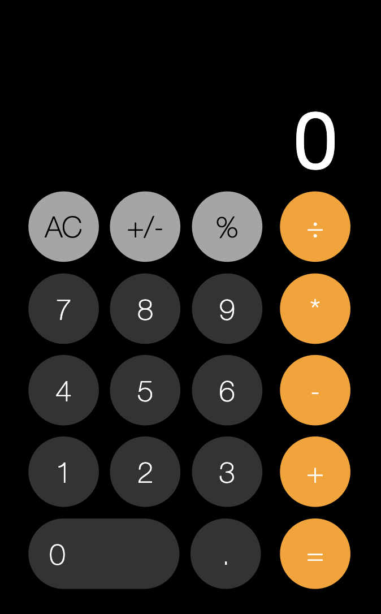

# iPhone Calculator - Vanilla JS

A simple calculator app built with vanilla Javascript for the web. It is similar to the iPhone calculator app.

> _Please note: the app still lacks some iPhone calculator features._

## Live Demo

- [Try it now](https://emanuelefavero.github.io/calculator-vanilla-js/)

#### Screenshot

## Run App

- Clone the repo
- Open the `index.html` file in your browser
